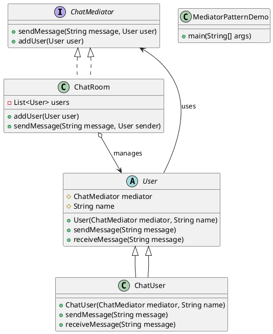

# Mediator Design Pattern in Java

The **Mediator Pattern** is a behavioral design pattern that promotes loose coupling between objects by centralizing communication through a mediator. Instead of objects communicating directly, they interact with a mediator, reducing dependencies.

---

## Example: Chat Room System

We will implement a **Chat Room** where users send messages through a mediator (`ChatMediator`), which delivers them to other users.

---

### Step 1: Create the Mediator Interface

```java
import java.util.ArrayList;
import java.util.List;

interface ChatMediator {
    void sendMessage(String message, User user);
    void addUser(User user);
}
```

```java
class ChatRoom implements ChatMediator {
    private List<User> users = new ArrayList<>();

    @Override
    public void addUser(User user) {
        users.add(user);
    }

    @Override
    public void sendMessage(String message, User sender) {
        for (User user : users) {
            if (user != sender) {
                user.receiveMessage(message);
            }
        }
    }
}

```

```java
abstract class User {
    protected ChatMediator mediator;
    protected String name;

    public User(ChatMediator mediator, String name) {
        this.mediator = mediator;
        this.name = name;
    }

    public abstract void sendMessage(String message);
    public abstract void receiveMessage(String message);
}

```


```java
class ChatUser extends User {
    public ChatUser(ChatMediator mediator, String name) {
        super(mediator, name);
    }

    @Override
    public void sendMessage(String message) {
        System.out.println(name + " sends: " + message);
        mediator.sendMessage(message, this);
    }

    @Override
    public void receiveMessage(String message) {
        System.out.println(name + " receives: " + message);
    }
}

```


```java
public class MediatorPatternDemo {
    public static void main(String[] args) {
        ChatMediator chatMediator = new ChatRoom();

        User user1 = new ChatUser(chatMediator, "Alice");
        User user2 = new ChatUser(chatMediator, "Bob");
        User user3 = new ChatUser(chatMediator, "Charlie");

        chatMediator.addUser(user1);
        chatMediator.addUser(user2);
        chatMediator.addUser(user3);

        user1.sendMessage("Hello, everyone!");
    }



```yaml
Alice sends: Hello, everyone!
Bob receives: Hello, everyone!
Charlie receives: Hello, everyone!
```

